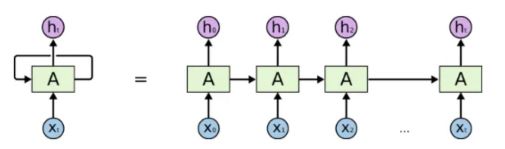

# NLP Final Project

## **Spam Email Classification Using Naïve Bayes and RNN Model**

##### *Bob Zhang, Alicia Xia, Jiechen Li*

##### *December 11, 2023*

## Background

### **Task Overview and Significance**

**Objective:** To systematically classify emails as either spam or non-spam using Naïve Bayes and RNN models. And conduct a comparative analysis of Naïve Bayes and RNN models in classifying spam emails, assessing their effectiveness, accuracy, and scalability on different datasets.

**Importance:** In the contemporary digital landscape, email has emerged as a fundamental tool for communication in professional, academic, and personal realms. It is not uncommon for individuals to receive upwards of 100 emails daily, encompassing a diverse array of content ranging from promotional material and workplace correspondence to academic communication and unsolicited spam. This high volume of emails can often lead to cognitive overload, diminishing focus and making users susceptible to deceptive practices like phishing attacks. In this context, the implementation of an efficient email classification system becomes paramount. Such a system not only streamlines the email management process but also serves as a critical line of defence, safeguarding users from potential cyber threats embedded within spam emails.

### **Rationale for Model Selection**

**Naïve Bayes**: Selected for its proven track record in text classification due to its simplicity, probabilistic approach, and suitability for high-dimensional datasets.

**RNN (Recurrent Neural Network)**: Chosen for its advanced capabilities in handling sequential data, making it adept at processing the linear structure of text present in emails.

### **Aim of the Study**

To conduct a comparative analysis of Naïve Bayes and RNN models in classifying spam emails, assessing their effectiveness, accuracy, and scalability on different datasets.

## **Methodology**

### **Acquisition of the Real Dataset**

The dataset, sourced from the [Kaggle](https://www.kaggle.com/datasets/nitishabharathi/email-spam-dataset), comprises 6,046 entries organised into three columns. These columns include the serial number of each email, the email body, and a spam classification indicator, where '1' denotes a spam email and '0' signifies a non-spam email, commonly referred to as 'ham'. Within this dataset, it is observed that 9% of the 'body' column entries are empty. In terms of classification, 4,150 emails are labelled as non-spam ('0'), while 1,896 emails are categorised as spam ('1').

## **The Synthetic Dataset**

**Preprocessing**: We splitted emails by line break, and in each line list, we tokenized each word into string, so at last, we have a list of lists of strings for our spam and ham emails. We finally took only first 800 sublists for spam and first 1000 sublists of ham as our original data pool.

**Synthetic Dataset Generation**: We respectively counted every token frequency in each group and created a dictionary, the key is each token, and the value is the times it appeared in that list. And we generated a list of 15 tokens in each sublist depending on the frequency of each token in the dictionary we created. Set parameter of weight for "random.choices" method, which means set each token with weight accordingly to the frequency of each token, than the method will randomly generate word one by one but with weight that we set.

## **Models**

**Naïve Bayes** is a text classification algorithm based on the core principle of Bayes' theorem, which assumes that the events in question are mutually independent. It employs Bayes' theorem to calculate the conditional probabilities of an email being spam or not spam, given the presence of certain specific words. The algorithm then compares these probabilities to determine whether an email is spam. The original formula is as follows:

$$P(C_k|X) = \frac{P(X|C_k) \times P(C_k)}{P(X)}$$

In our case, since we are comparing the Bayesian probabilities of two categories for the same text, the denominator $P(X)$ remains constant and can be omitted. Therefore, the final formula is simplified to

$$P(C_k|X) = P(x_1) \times P(x_2) \times ... \times P(x_n)$$

**Recurrent Neural Networks (RNN)** has the capability to recall previous inputs thanks to its internal memory, making it effective for forecasting stock market trends, creating text, performing transcription, and facilitating machine translation. In a conventional neural network, the inputs and the outputs are independent of each other, whereas the output in RNN is dependent on prior elements within the sequence. Recurrent networks also share parameters across each layer of the network. In feedforward networks, there are different weights across each node. Whereas RNN shares the same weights within each layer of the network and during gradient descent, the weights and basis are adjusted individually to reduce the loss. In RNN, information continually passes through a loop structure. As a result, the output at any given moment is shaped not only by the current input but also by the inputs received previously.

 

## **Implementation of Naive Bayes**

**Initialization**: The NaiveBayesEmailClassifier class is initialised with a variable "vocabulary_map". This map is crucial as it translates each unique word in the dataset into a numerical index, which is used for vector representation of the words.

**One-Hot Encoding**: The one hot method generates a one-hot encoded vector for a given token. This binary vector represents the presence of a word in the vocabulary, where the index corresponding to the word is set to 1, and all other indices are set to 0.

**Document Encoding**: The function "encode_document" method applies one-hot encoding to each token in a document. This process converts the textual data into a numerical format, suitable for model training and prediction.

**Data Splitting**: The function "split_data" method is responsible for dividing the dataset into training and testing subsets. This division is based on the provided percentage for the test set. The method takes separate lists of spam and non-spam samples, encodes them, and then shuffles the combined set before splitting.

**Model Training**: The function "train_naive_bayes" method trains the Naive Bayes classifier. It separates the training data into spam and non-spam documents and creates language models for each category using the UnigramModel. These models calculate the probability of each word given the category (spam or non-spam). Additionally, the method computes the prior probabilities "ph0" and "ph1" for each category.

**Prediction**: The predict method is the core of the classifier. It calculates the log probabilities of a document being in each category (spam or non-spam), normalizes these probabilities, and then predicts the category based on which probability is higher.

## Implementation of RNN model

#### Overview

This report details the implementation of a Recurrent Neural Network (RNN) using TensorFlow and Keras, aimed at classifying emails into 'spam' and 'non-spam' categories. The code is structured to handle both original and synthetic datasets.

#### Data Loading and Preprocessing

- **Data Sources:**

  - **`completeSpamAssassin.csv`**: Presumably a collection of real email data.

  - **`sythetic_dataset.csv`**: A synthetic dataset, possibly generated for testing purposes.

- **Preprocessing Steps:**

  - Email bodies are converted to strings, and any NaN values are filled with empty strings.

  - Tokenization is performed on the email bodies using Keras's **`Tokenizer`**, with a vocabulary size of 5000 words and an Out-Of-Vocabulary (OOV) token.

  - The dataset is split into training and testing sets using **`train_test_split`** with a test size of 20%.

  - Sequences are padded to ensure uniform length using **`pad_sequences`** with a maximum length of 200.

#### Model Implementation

- **Model Architecture:**

  - The RNN model is a sequential model consisting of:

    - An Embedding layer with an input dimension of 5000 and output dimension of 64.

    - A SimpleRNN layer with 64 units.

    - A Dense output layer with a sigmoid activation function, suitable for binary classification.

  - The model uses binary cross-entropy as the loss function and Adam optimizer. The main metric for performance evaluation is accuracy.

- **Training and Testing:**

  - The model is trained for 10 epochs with a validation split of 20%.

  - The performance of the model is evaluated on the test set, and the accuracy is printed.

#### Execution

- The code is structured to run the RNN model on both the original (**`completeSpamAssassin.csv`**) and synthetic (**`sythetic_dataset.csv`**) datasets.

- The model summary and training process, along with the test accuracy, are displayed during execution.

#### Additional Components

- The code includes imports from a **`lib`** directory, indicating the use of custom modules for email processing and Naive Bayes classification. These components seem to be part of a larger project but are not directly involved in the RNN model execution.

### **Recommendations and Notes**

- To enhance this report, details like the specific performance metrics (accuracy) and any observed differences in performance between the original and synthetic datasets would be valuable.

- It's important to consider overfitting, especially with a relatively small dataset. Regularization techniques or dropout layers in the RNN might be useful to address this.

- The effectiveness of the tokenization and sequence padding parameters should be evaluated, as these can significantly impact model performance.

**Experiment Results**

|                               |           |                 |
|-------------------------------|-----------|-----------------|
|                               | **RNN**   | **Naive Bayes** |
| **Test (Real) Accuracy**      | **0.54**  | **0.9**         |
| **Test (Synthetic) Accuracy** | **0.458** | **0.95**        |

With the updated accuracy figures for the RNN model on the synthetic dataset, we can reassess the performance of both models:

### Performance Analysis

#### Test (Real) Accuracy

- **RNN: 0.54**
  - The RNN's moderate accuracy on the real dataset indicates challenges in capturing the complexities of real-world email data. Factors like the model's architecture, overfitting, or inadequate training data might be influencing this performance.
- **Naïve Bayes: 0.9**
  - The high accuracy of Naïve Bayes on the real dataset suggests its effectiveness in this context. The model's assumption of feature independence appears to align well with the characteristics of the real-world data, leading to strong predictive performance.

#### Test (Synthetic) Accuracy

- **RNN: 0.458**
  - The RNN's performance drops further on the synthetic dataset. This could be due to the dataset's lack of complex, sequential patterns that RNNs are adept at learning, or it might be too uniform, making it challenging for the RNN to effectively differentiate between classes.
- **Naïve Bayes: 0.95**
  - The increase in accuracy for Naïve Bayes on the synthetic dataset, as compared to the real dataset, is noteworthy. This superior performance indicates that the synthetic data possibly adheres more closely to the assumptions of Naïve Bayes, such as feature independence. It also suggests that the synthetic data might be less complex than the real data, making it easier for a simpler model like Naïve Bayes to classify accurately.

#### Comparative Performance Analysis

- **RNN vs. Naïve Bayes Performance:**

  - The RNN model might perform better on complex or larger datasets due to its ability to capture sequential information and context, which is vital in understanding the nuances of language in emails.

  - Naïve Bayes, being simpler and based on the assumption of feature independence, might perform better on smaller or less complex datasets. But it ignores the relationship between word and word, and also the long distance realtionship of sentence, so it will generate a synthetic data which has no meaning.

- **Performance on Real vs. Synthetic Dataset:**

  - The RNN might excel in real datasets due to its capability to learn contextual nuances, while Naïve Bayes might struggle if these nuances are significant.

  - In synthetic datasets, where data might be more controlled or uniform, the performance gap might reduce, or Naïve Bayes might even outperform due to its simplicity and less tendency to overfit in such scenarios.

Further investigations could involve a deeper analysis of the datasets to understand why Naïve Bayes performs consistently well and why the RNN struggles, particularly with the synthetic data. Additionally, exploring other model architectures or data augmentation techniques might help improve the RNN's performance.

## Limitation of RNN

Simple RNN models often encounter two significant challenges, both of which are associated with the gradient. The gradient is essentially the slope of the loss function in relation to the error function.

1. The vanishing gradient problem arises when the gradient diminishes to such an extent that updates to the parameters become negligible. As a consequence, the learning process of the algorithm gradually halts.

2. The exploding gradient problem occurs when the gradient grows excessively large, leading to instability in the model. In this scenario, large error gradients accumulate, resulting in disproportionately high model weights. This issue can lead to extended training durations and suboptimal performance of the model.
